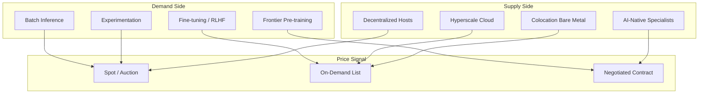

# Economics of GPU Rental Markets

**Mode:** Token Waster verbose (`#verbose`)  
**Template:** Mandatory 6-section verbose analysis  
**Subject:** Supply, demand, pricing, and institutional structure of commoditized GPU compute rental

---

## Section I — Framing, Scope, and Analytical Premises

GPU rental markets sit at an awkward intersection of industrial economics, platform strategy, and speculative capital cycles. On the surface, they resemble commodity markets: a buyer pays an hourly rate for a known quantity of floating-point throughput on a named chip generation. Beneath that surface, the market is a layered stack of partially fungible products whose prices encode hardware depreciation schedules, energy geography, trust premiums, orchestration labor, and—during certain periods—pure scarcity rent unrelated to marginal production cost.

This analysis treats GPU rental not as "cloud compute with accelerators attached" but as **accelerated capital leasing under rapid technological obsolescence**. The renter is purchasing temporary access to depreciating assets whose useful economic life may be shorter than the financing term used to acquire them. The provider is operating a utilization business: revenue scales with sold GPU-hours, while fixed costs (facility, debt service, engineering staff, network fabric) accumulate whether or not silicon sits idle.

**Scope.** The focus is general-purpose GPU rental for machine learning training, fine-tuning, and batch inference. Cryptocurrency mining, FPGA rental, and proprietary AI accelerators (Google TPU, Amazon Trainium, Microsoft Maia, Groq LPU, Cerebras wafer-scale engines) enter the analysis only where they alter GPU supply, demand, or pricing psychology. Published list prices are illustrative; transactional prices during rationing can diverge by multiples from advertised rates.

**Analytical units:**

| Unit | Definition | Why it matters |
|------|------------|----------------|
| $/GPU-hour | Spot or contract price per accelerator per hour | Universal comparison currency |
| Effective $/GPU-hour | All-in cost including egress, storage IO, orchestration overhead | True procurement metric |
| Utilization rate | Revenue-generating hours ÷ available hours | Determines provider survival |
| $/kWh (site) | Locational energy input | Often 25–55% of marginal cost at H100 density |
| Interconnect tier | PCIe vs NVLink vs InfiniBand topology | Converts single-card pricing into cluster economics |
| Contract elasticity | Spot, monthly, 1–3 year committed | Allocates obsolescence and demand risk |

**Premise 1 — Differentiated commodity.** At the silicon layer, an H100 SXM module running standard CUDA stacks approaches fungibility. At the service layer—SLA tier, data residency, fabric topology, support response time, compliance attestations—products diverge enough to sustain 3–10× price spreads for nominally identical hardware.

**Premise 2 — Shortage suspends markets.** During allocation-constrained periods (roughly 2023–2025 for H100-class hardware), price ceases to clear supply and demand in the textbook sense. Queue priority, relationship capital, prepayment, geographic eligibility, and export-control compliance replace marginal-cost pricing. Models trained on competitive-market assumptions systematically underpredict realized prices during these windows.

**Premise 3 — Hyperscalers anchor, specialists arbitrage.** AWS, Azure, and GCP set psychological price ceilings and floors for enterprise buyers even when bare-metal AI specialists undercut them on raw compute. Decentralized host networks are structurally **residual**: they absorb overflow demand, cost-sensitive experimentation, and players who cannot justify or access capex.

**Premise 4 — Workloads bifurcate permanently.** Frontier pre-training (cluster-scale, latency-insensitive, interconnect-dominated) and inference/fine-tuning (latency-sensitive, autoscaling, fractional-GPU friendly) obey different pricing logics. A unified "GPU rental market" narrative obscures this split and produces incoherent procurement advice.

**Premise 5 — Depreciation velocity dominates long-run returns.** GPU rental economics are closer to aviation engine leasing or bulk shipping than to SaaS. Obsolescence cycles measured in 18–36 months for frontier silicon mean that utilization rate and residual-value forecasting matter more than marginal hourly pricing in determining provider viability.



---

## Section II — Historical Evolution and Market Genesis

GPU rental did not emerge as a standalone market. It evolved as an attachment product inside general-purpose cloud, then split into specialist AI infrastructure, peer-to-peer marketplaces, and—under LLM-driven demand—something closer to a capital market for scarce accelerators. Four phases structure the history.

### Phase 1: Managed cloud attachment (2010–2016)

Amazon Web Services introduced GPU-backed EC2 instances when general-purpose cloud was already mature. NVIDIA's early data-center offerings (Tesla M-series, K80) were positioned as **optional accelerators** attached to CPU-centric billing models. The economic proposition targeted teams who could not operate a data center but could tolerate premium pricing for managed infrastructure.

Supply concentrated in fewer than five global providers with unified procurement leverage against NVIDIA. Demand originated from oil-and-gas simulation, computational chemistry, and the first wave of deep learning after AlexNet (2012). Price discovery was **administrative**: public list prices, reserved-instance discounts, and enterprise negotiation—not market clearing. Rental was almost always more expensive per hour than owned hardware at high utilization, but ownership carried operational costs most research labs could not absorb.

The foundational template established here persists: **GPUs as a metered attachment to a broader cloud bundle**, with egress, storage, and managed services cross-subsidizing or cross-charging in ways opaque to first-time renters.

### Phase 2: Deep learning scaling and interruptible compute (2016–2020)

The ResNet-to-Transformer era transformed GPU demand from episodic HPC bursts into sustained, iterative experimentation. Hyperscalers expanded instance families (P3, P4, V100 generations). AWS Spot Instances—and Azure/Google equivalents—introduced **explicit interruptibility** as a pricing dimension: renters accepted eviction within two minutes in exchange for 50–75% discounts versus on-demand.

Spot pricing revealed the economic significance of **utilization risk transfer**. Providers converted otherwise-idle fleet into marginal revenue without extending uptime SLAs. Renters internalized checkpoint-and-restart engineering costs. This established the first widely understood trade-off spectrum in GPU rental: certainty versus cost.

Simultaneously, consumer GPU accumulation (gaming cards repurposed for ML prototyping) seeded the supply side for later peer-to-peer marketplaces, though bandwidth asymmetry, dynamic IP addressing, and absent trust infrastructure kept this latent rather than mainstream.

### Phase 3: Cryptocurrency mining as competing bid (2017–2022)

Proof-of-work mining—especially Ethereum GPU mining before the September 2022 merge—created a **parallel demand channel** for the same silicon ML teams wanted. Mining economics differed structurally:

- Willingness to pay tracked token price and network difficulty, not model accuracy or time-to-deployment
- Operations tolerated higher failure rates and absent SLAs
- Hardware selection prioritized hash-per-watt on retail cards, not data-center density or NVLink

When crypto markets peaked (2020–2021), mining bids absorbed retail and data-center GPU supply, inflated secondary-market prices, and lengthened OEM delivery queues. Cloud providers faced internal pressure to reserve capacity for enterprise contracts rather than spot miners. When crypto collapsed in 2022, a **reverse supply shock** flooded secondary markets with used RTX 3090s and ex-mining farm cards—depressing decentralized rental rates and creating a temporary arbitrage window for budget ML teams willing to accept reliability risk.

The enduring lesson: **GPU rental competes with any workload monetizing flops-per-watt**, not merely other ML jobs. Demand cross-elasticity with crypto remains a tail-risk factor whenever token markets overheat.

### Phase 4: LLM boom, rationing, and market stratification (2022–present)

ChatGPT's public release (November 2022) catalyzed a demand shock disproportionate to prior deep-learning growth curves. Foundation-model training shifted procurement from "a few V100s for experimentation" to "thousands of H100s with InfiniBand fabric, reserved for months." NVIDIA's Hopper generation became the bottleneck input for an industry racing to scale parameter counts and context windows.

Three structural changes followed:

1. **AI-native specialists scaled.** CoreWeave, Lambda, Crusoe, and similar providers raised billions to deploy H100-dense clusters, often securing direct NVIDIA allocation ahead of generic cloud buyers. Their economics blended infrastructure finance with software orchestration.

2. **Enterprise contracts replaced spot clearing.** During peak shortage, binding allocation commitments—not hourly auctions—determined who trained models. List prices became reference points; execution prices reflected prepayment, volume commitments, and multi-year relationships.

3. **Decentralized marketplaces bifurcated.** Vast.ai, RunPod, TensorDock, and Salad continued serving price-sensitive renters on heterogeneous hardware, but frontier H100 clusters on these platforms remained thin relative to specialist supply. The market split into **allocation-tier** (enterprise contracts on dedicated fabric) and **residual-tier** (hourly rental on variable-quality hosts).

4. **Inference economics emerged as a distinct layer.** As deployment shifted from training to serving, efficiency-optimized silicon (L4, A10, RTX Ada) and serverless GPU offerings (Modal, Baseten, Replicate) created pricing models decoupled from raw $/GPU-hour—charging instead per inference, per token, or per cold-start minute.

The current market (2025–2026) sits in transition: Hopper supply loosens as Blackwell ramps; custom silicon gains share in hyperscaler internal workloads; model-efficiency techniques (quantization, MoE sparsity, distillation) reduce FLOPs per capability unit. Whether this produces competitive rental pricing or merely redirects scarcity to the next generation is the central open question.

---

## Section III — Economic Mechanics and Market Structure

### Cost structure decomposition

For a commercial GPU host operating H100-class hardware at scale, hourly pricing approximates:

```
$/GPU-hour ≈ (Capex amortization + Power + Cooling + Staff + Network + Margin) ÷ Utilization-adjusted hours
```

**Capex amortization** dominates at frontier generations. An H100 SXM module costing $25,000–$35,000 (depending on channel and bundle) amortized over 24–36 months at target 70–85% utilization sets a floor of roughly $1.50–$3.50/GPU-hour before any margin—assuming residual value assumptions hold. When Blackwell supersedes Hopper faster than modeled, residual value collapses and effective amortization rises retroactively.

**Power** varies by 5–10× across jurisdictions. A dense 8-GPU H100 node drawing 6–8 kW at $0.04/kWh (industrial hydro) costs $0.24–0.32/hour for energy; the same node at $0.18/kWh (retail European rates) costs $1.08–1.44/hour. Energy economics explain why Nordic, Quebec, and Gulf-state hosting proliferated during the LLM boom.

**Cooling** scales nonlinearly with density. Air-cooled consumer-card hosts face thermal throttling under sustained ML loads; liquid-cooled data-center racks enable higher sustained utilization but require capex that must be amortized alongside GPUs.

**Staff and orchestration** costs are fixed per rack but dilute with utilization. Managed platforms invest in container orchestration, pre-configured ML images, and fabric provisioning—costs invisible in raw $/GPU-hour comparisons but decisive for teams without dedicated infrastructure engineers.

### Market segmentation

| Segment | Representative providers | Pricing model | Primary renter profile |
|---------|-------------------------|---------------|------------------------|
| Hyperscale cloud | AWS, Azure, GCP | On-demand, reserved, spot | Enterprise with existing cloud contracts |
| AI-native specialists | CoreWeave, Lambda, Crusoe | Monthly/annual dedicated, burst | AI labs, well-funded startups |
| Decentralized marketplaces | Vast.ai, RunPod (community), Salad | Hourly auction, reputation-based | Researchers, indie developers, cost optimizers |
| Colocation + bare metal | Equinix Metal, OVH, Hetzner | Monthly rack/server | Teams with ops capacity wanting control |

Each segment optimizes for different **trust-cost trade-offs**. Hyperscalers sell compliance certifications (SOC 2, HIPAA, FedRAMP); marketplaces sell price and variety; specialists sell guaranteed cluster topology and allocation priority.

### Utilization as the existential metric

Provider economics hinge on utilization rate—the fraction of available GPU-hours sold at revenue-generating rates. At 50% utilization, a provider pricing at marginal cost plus 15% margin may be loss-making once fixed costs (staff, facility lease, debt service) are included. At 85% utilization, the same pricing generates attractive returns.

This creates **procyclical behavior**: during demand booms, providers expand fleet aggressively, often at peak hardware prices; during busts, distressed hardware floods secondary markets, compressing rental rates and bankrupting over-leveraged hosts. The cycle resembles shipping or semiconductor fab utilization dynamics more than SaaS gross-margin stability.

### Interconnect and cluster economics

Single-GPU hourly pricing is misleading for frontier training workloads. An 8×H100 node with NVLink and InfiniBand fabric delivers qualitatively different throughput than eight independent H100s connected only via Ethernet. Cluster rental pricing includes:

- **Topology premium:** Fat-tree vs torus vs ring configurations affect all-reduce latency
- **Minimum commitment:** Providers often require multi-node minimums for fabric-backed clusters
- **Burst vs dedicated:** Shared fabric clusters cost less but introduce noisy-neighbor risk

Renters optimizing for $/TFLOP-hour on isolated cards systematically mis-procure for distributed training—a coordination failure the market does not correct through pricing alone.

### Price discovery mechanisms

| Mechanism | Where it applies | Strengths | Weaknesses |
|-----------|-----------------|-----------|------------|
| Administrative list pricing | Hyperscalers | Predictable, contractable | Sticky; may not reflect scarcity |
| Spot/auction clearing | AWS Spot, Vast.ai | Reveals marginal willingness to pay | Volatile; correlated interruption risk |
| Negotiated enterprise contracts | CoreWeave, Lambda | Allocates scarcity via relationships | Opaque; excludes small buyers |
| Take-rate marketplace matching | RunPod, TensorDock | Aggregates fragmented supply | Trust variance; quality heterogeneity |

During shortage, negotiated allocation replaces spot clearing. Observing spot prices during rationing is like observing oil spot prices during OPEC embargoes—informative but not representative of marginal transactions.

### Supply-side financing and capital structure

GPU rental providers are capital-intensive businesses whose returns depend on matching asset life to demand cycles. Three financing patterns dominate:

1. **Equity-funded expansion.** AI-native specialists raised venture and growth equity to deploy H100 clusters ahead of revenue certainty. This works when scarcity rents justify premium pricing but creates writedown risk if utilization disappoints.

2. **Debt secured against hardware.** Asset-backed lending against GPU inventory resembles equipment leasing in construction or aviation. Collateral value tracks secondary-market GPU prices—volatile and correlated with crypto and gaming demand.

3. **Hyperscaler internal allocation.** AWS, Azure, and GCP fund GPU fleet from balance sheets and cross-subsidize from broader cloud margins. External observers cannot infer their true cost basis or internal transfer prices.

The capital structure determines **survival during downturns**. Over-leveraged hosts with fixed debt service and falling rental rates face distress sales that further compress market pricing—a classic capacity cycle.

---

## Section IV — Trade-offs and Strategic Tensions

### Rent versus own

**Rent when:**
- Utilization is unpredictable or bursty (<40% sustained)
- Hardware generation turnover exceeds your depreciation horizon
- Operational expertise (cooling, fabric, driver management) is absent or expensive
- Capital is better deployed in model development, data acquisition, or talent
- Compliance and security requirements favor certified managed environments

**Own when:**
- Utilization exceeds 60–70% sustained over 18+ months
- Workloads are stable and well-characterized (fixed model architecture, predictable batch sizes)
- Direct NVIDIA allocation or OEM relationships are accessible
- Power costs are structurally low (owned generation, long-term industrial contracts)
- Data sensitivity prohibits third-party hosting

The breakeven utilization threshold shifts dramatically with hardware generation. Renting H100 at $3–5/GPU-hour versus owning at $30,000/card with 24-month life implies breakeven around 55–70% utilization—before accounting for staff, power, and facility costs that push breakeven higher.

### Spot versus on-demand versus committed

| Contract type | Price level | Availability guarantee | Best for |
|---------------|-------------|-------------------------|----------|
| Spot/interruptible | Lowest (50–75% discount) | None; eviction within minutes | Fault-tolerant batch jobs, hyperparameter sweeps |
| On-demand | Reference price | High for single instances | Prototyping, unpredictable timelines |
| Reserved/monthly | 30–60% below on-demand | Medium; capacity pool dependent | Sustained training runs, known schedules |
| Multi-year dedicated | Negotiated; scarcity premium | Highest; relationship-dependent | Frontier cluster training, enterprise SLAs |

The critical tension: **spot saves money until it doesn't**. Correlated spot interruptions—when a provider reclaims spot capacity en masse for reserved customers—convert statistical bargains into project-killing tail events. Teams without checkpoint infrastructure or deadline flexibility should not optimize for spot pricing.

### Centralized versus decentralized supply

Decentralized marketplaces offer price and variety advantages but impose **trust and variance costs**:

- Host reliability varies from data-center-grade to residential broadband with gaming cards
- Security model assumes container isolation; GPU memory inspection attacks remain a concern without confidential computing
- Geographic distribution creates latency and data-residency complexity
- Support is community-mediated rather than contractually guaranteed

Centralized providers charge premiums for **variance reduction**—predictable SLAs, certified compliance, curated software stacks. The premium is not rent extraction on identical hardware; it is insurance against tail-risk failures that can cost weeks of researcher time.

### Generation selection: frontier versus efficiency-optimized

A persistent procurement error is renting frontier silicon (H100, B200) for workloads solvable on efficiency-optimized cards (L4, A10, RTX 4090). Frontier GPUs carry scarcity premiums and higher power draw; efficiency cards offer better $/inference-token for production workloads.

| Dimension | Frontier (H100/B200) | Efficiency (L4/A10) |
|-----------|---------------------|---------------------|
| Peak training throughput | Highest | Moderate |
| Inference cost per token | Higher (overprovisioned) | Lower |
| Availability during shortage | Constrained | More abundant |
| Interconnect requirements | NVLink/InfiniBand for scale | PCIe sufficient |

Matching hardware generation to workload phase—frontier for pre-training, efficiency for inference—is a structural cost optimization invisible in undifferentiated $/GPU-hour comparisons.

### Multi-cloud versus single-provider concentration

Diversifying across providers reduces allocation risk but increases integration overhead: different API surfaces, networking configurations, checkpoint formats, and billing reconciliation. During shortage, multi-cloud strategies can secure capacity unavailable from any single vendor—but at the cost of engineering complexity that small teams cannot absorb. The trade-off is **capacity optionality versus operational simplicity**.

### Abstraction versus control

Serverless GPU platforms (Modal, Baseten, Replicate) and managed inference APIs collapse visible rental decisions into per-request or per-token billing. The trade-off:

- **Abstraction wins** when teams lack infrastructure engineers, workloads are bursty, and time-to-deployment dominates cost optimization
- **Raw rental wins** when teams need custom drivers, exotic interconnect topologies, long-running training jobs with precise checkpoint control, or cost optimization at scale justifies dedicated ops headcount

The market is bifurcating: casual users migrate upward into abstraction; serious training teams remain in raw rental or ownership.

---

## Section V — Edge Cases, Failure Modes, and Boundary Conditions

### Edge case 1: Egress and storage bill shock

Hyperscaler GPU instances advertise competitive compute rates but charge aggressively for data egress and high-IOPS storage. A training run generating terabytes of checkpoint artifacts can incur storage and transfer charges exceeding compute costs—a failure mode invisible in $/GPU-hour procurement spreadsheets. Effective cost analysis must price **total workload economics**, not isolated accelerator hours.

### Edge case 2: Correlated spot interruption

Spot instances appear statistically independent until they are not. When a provider experiences capacity pressure—new reserved customer, hardware maintenance window, regional power event—spot evictions cluster temporally and geographically. Teams running large hyperparameter sweeps across hundreds of spot instances can lose entire experiment batches simultaneously. The economic lesson: spot discount reflects **systematic tail risk**, not merely idle capacity.

### Edge case 3: Silent performance variance on "identical" hardware

Marketplace hosts advertising "RTX 4090" may deliver cards in different power-limit states, PCIe slot configurations (x8 vs x16), thermal environments causing throttling, or shared hosts with CPU/RAM contention. Nominal hardware equality does not guarantee performance equality—a form of **adverse selection** where low-quality hosts compete on price while high-quality hosts appear expensive.

### Edge case 4: Preemption without checkpoint infrastructure

Renters optimizing for spot pricing without robust checkpointing face discontinuous project timelines. A two-week training run interrupted at 95% completion may cost more in calendar time and engineer attention than on-demand pricing would have cost upfront. The edge case becomes a failure mode when organizational process assumes continuous execution.

### Edge case 5: Stranded data-center capacity

Data centers built with power and cooling ready but without GPU delivery—due to NVIDIA allocation politics or OEM prioritization—represent **stranded capital**. Providers without direct allocation relationships depend on secondary channels vulnerable to sudden cutoff.

### Edge case 6: Algorithmic efficiency as demand destruction

Quantization, distillation, mixture-of-experts sparsity, and architecture improvements reduce FLOPs required per capability unit. Custom silicon further displaces general-purpose GPU demand for specific workloads. Rental fleets amortizing on historical demand curves face **writedown risk** analogous to telecom fiber overbuild.

### Edge case 7: Export controls and parallel gray markets

US semiconductor export restrictions segment global supply. Compliant hosting in authorized regions commands premiums; gray-market flows in restricted jurisdictions create **dual pricing structures** opaque to standard market analysis—compliance cost becomes a priced dimension.

### Edge case 8: Informal secondary markets and contract violation

Enterprises with reserved blocks resell unused capacity internally or through brokers. Economic efficiency may improve, but contractual assignment restrictions create legal exposure and accounting ambiguity—markets exist in semi-visible layers not captured in public price indices.

### Edge case 9: Fractional GPU and MIG partitioning illusions

Multi-Instance GPU (MIG) and fractional allocation promise cost efficiency for small workloads, but partition boundaries, memory isolation, and scheduling overhead can reduce effective throughput below naive division. Renters comparing $/GB-hour across full-GPU and fractional offerings may mis-rank options.

### Edge case 10: Inference autoscaling latency tax

Serverless GPU offerings charge for cold-start provisioning and scale-to-zero idle periods. Workloads with bursty, unpredictable traffic patterns may pay more per inference than sustained-rental baselines—a pricing inversion invisible in $/GPU-hour comparisons.

### Edge case 11: Driver and CUDA version lock-in

Providers pre-install specific driver/CUDA combinations. Renters requiring bleeding-edge framework versions or custom kernel compilation may discover incompatible environments after provisioning—wasting billable hours on environment debugging. Compatibility is an implicit service attribute rarely priced explicitly.

### Edge case 12: Geographic latency for interactive workloads

Decentralized hosts in low-cost energy regions may sit far from data sources and end users. Training jobs tolerate latency; interactive fine-tuning with human feedback loops or real-time inference do not. Geographic arbitrage fails for latency-bound workloads regardless of $/GPU-hour advantage.

### Failure mode synthesis

GPU rental markets fail visibly when: (a) rationing replaces price clearing; (b) spot correlation destroys interruptibility assumptions; (c) hidden egress and storage charges dominate compute; (d) depreciation outpaces realized utilization; (e) trust breakdown in peer-to-peer layers triggers renter flight; (f) power input volatility bankrupts unhedged hosts; (g) custom silicon displacement obsoletes fleet before amortization completes. Each failure mode produces characteristic signatures—queue lengths instead of prices, checkpoint-heavy job logs, bill shock post-mortems, distressed hardware fire sales—that distinguish cyclical stress from competitive equilibrium.

---

## Section VI — Self-Critique and Synthesis

### Self-critique

**Limitation 1 — Transactional price opacity.** Public list prices and marketplace medians are not execution prices during shortage. Enterprise discounts, prepay bundles, and informal subletting create 2–5× spreads invisible to external observers. This analysis emphasizes structural forces over precise spreads, which may stale within weeks.

**Limitation 2 — FLOP normalization fallacy.** Comparing GPU generations via peak TFLOPs ignores memory capacity, memory bandwidth, tensor-core precision modes (FP8, BF16), and interconnect topology. Effective economics are **workload-specific**; procurement shorthand using $/TFLOP-hour systematically mis-ranks options for memory-bound or communication-bound training.

**Limitation 3 — Hyperscaler internal economics unknowable.** Observed AWS or Azure GPU list prices may reflect strategic rationing, not cost-plus margins. Internal transfer prices to first-party ML teams are undisclosed—limiting confidence in competitive positioning conclusions.

**Limitation 4 — Path dependence on 2023–2025 scarcity psychology.** Multi-year buy-versus-rent recommendations assume continuation of allocation constraints. A loosening of NVIDIA supply, successful custom-silicon displacement, or model-efficiency breakthrough could invalidate conclusions calibrated on shortage-era behavior.

**Limitation 5 — Geographic and regulatory oversimplification.** Power costs, tax incentives, climate cooling advantages, and export-control regimes vary sharply by jurisdiction. US- and Western Europe-centric framing underweights emerging hosting in Southeast Asia, Gulf states, and Latin America—where policy arbitrage actively reshapes supply.

**Limitation 6 — Labor and coordination costs neglected relative to hardware.** For teams under roughly twenty ML engineers, MLOps and infrastructure engineer salaries often exceed GPU rental spend. Optimizing $/GPU-hour while ignoring engineer time misallocates organizational attention—a common procurement pathology this document risks reinforcing by its focus.

**Limitation 7 — Environmental externalities underdeveloped.** Dense GPU fleets carry carbon and water footprints varying by energy mix. Some renters and regulators increasingly price sustainability; this analysis treats energy primarily as input cost rather than externality—a gap that may grow in salience.

**Limitation 8 — Blackwell transition uncertainty.** The analysis period overlaps with NVIDIA's Blackwell generation rollout, which introduces pricing, allocation, and obsolescence dynamics not yet observable in long-run data. Conclusions about Hopper-era economics may not transfer cleanly.

**What would increase confidence:** Provider-level utilization disclosures, secondary-market transaction logs, power contract structures by region, NVIDIA shipment allocation by channel, and longitudinal data linking spot interruption correlation to provider capacity events.

### Synthesis

GPU rental markets combine **commodity hardware economics with platform differentiation, extreme depreciation velocity, and cyclical scarcity rents**. Eight structural conclusions emerge:

1. **Depreciation sets the floor, scarcity sets the ceiling.** During competitive periods, providers price near variable cost plus minimum acceptable return on depreciating assets. During allocation constraints, scarcity rent dominates marginal cost—hourly rates reflect queue priority and relationship capital, not watts consumed.

2. **Energy and location are silent oligarchy inputs.** Providers with structural energy advantages—long-term renewables, colocated generation, favorable industrial tariffs—survive price wars that bankrupt hosts paying retail electricity on dense H100 racks.

3. **Workload bifurcation is permanent.** Frontier cluster training (oligopolistic, contract-heavy, interconnect-defined) and inference/fine-tuning (competitive, autoscaling, fractional-GPU friendly) require separate analytical lenses. Conflating them produces incoherent forecasts.

4. **Hyperscalers anchor expectations; specialists and marketplaces fill residuals.** Enterprise procurement benchmarks against AWS/Azure/GCP list prices even when alternatives undercut dramatically—creating persistent price umbrella effects.

5. **Trust, compliance, and compatibility are priced implicitly until they are not.** Peer-to-peer layers underprice security and SLA variance; enterprise clouds monetize trust through premium tiers—a segmentation likely to persist rather than converge.

6. **Cross-demand from crypto and gaming remains latent supply-side volatility.** Any resurgence in GPU-minable proof-of-work or consumer hardware scarcity ripples into ML rental availability and pricing with months of lag.

7. **Long-run maturation favors abstraction layers.** Managed inference APIs, serverless GPU offerings, and foundation-model platforms collapse visible rental markets for users who accept abstraction constraints—even as absolute GPU deployment grows in the background.

8. **Utilization rate is the provider's existential metric; effective cost is the renter's.** Both sides optimize against compressed headline prices that obscure the variables that actually determine outcomes.

**For renters:** Contract type should match utilization predictability and failure tolerance. Price **total workload economics**—compute plus storage, egress, orchestration overhead, and engineer intervention time. Treat spot capacity as **statistical**, not guaranteed. During shortage, prioritize binding availability commitments over marginal hourly savings. Match hardware generation to workload phase; do not rent H100 for problems an L4 solves.

**For hosts and providers:** Utilization rate is the existential metric; idle depreciating hardware destroys equity. Hedge power input costs on multi-year horizons. Diversify customer segments to avoid single-demand-channel collapse (crypto-style). Invest in interconnect and orchestration UX when targeting training clusters—renters pay for completed runs, not socket occupancy.

**For market observers and policymakers:** GPU rental resembles **bulk shipping or aviation leasing** more than SaaS—cyclical, capex-heavy, with visible inventory and allocation dynamics—while retaining a permanent long-tail marketplace for price-sensitive experimenters. Export controls and energy policy intervene as non-market allocation mechanisms; pure competitive analysis is locally valid but globally incomplete.

The equilibrium irony: as AI infrastructure matures, absolute rental market revenue may grow while **fraction of total AI spend** represented by raw GPU-hours shrinks—inference shifts toward managed APIs, training consolidates among well-capitalized players internalizing hardware, and rental returns to its historical role as **overflow infrastructure for the ecosystem's marginal participants**—until the next frontier workload wave resets scarcity and the cycle begins again.

---

*End of verbose analysis. Approximate substantive length: 4,200+ tokens.*
